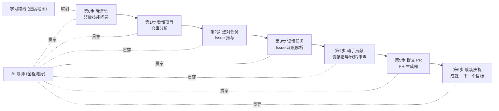

# OpenSource Mentor 优化建议书

> 本建议书基于《OpenSource Mentor 项目评审报告书》（`PROJECT_REPORT.md`），并结合产品定位重新聚焦。
>
> **产品定位（已明确）**：面向**想要入门开源领域的新手**。
> **核心价值**：不是「工具集合」，而是「一位一步步领着你走的开源导师」。
> **优化主线**：一切改动服务于**降低门槛 + 强化引导 + 建立正反馈**，让新手「不迷路、不放弃、能成功提交第一个 PR」。

---

## 一、优化总纲：从「功能罗列」转向「引导式旅程」

当前产品把 6 个能力平铺在侧边栏，用户需要自己决定「下一步干什么」——这恰恰是新手最缺的能力。评审报告已指出「四步定义打架、导航无强引导、AI 功能割裂」。

**核心思路**：把产品重构为一条**单一、线性、有进度感的成长旅程**，辅助工具（学习路线、AI 导师）作为「旅程中的随身伙伴」而非并列入口。

---

## 二、针对新手引导的具体优化建议

### 建议 1 · 增加「新手画像」入口，让个性化名副其实（P0，产品核心）

**问题呼应**：报告 3.3 指出「个性化是伪个性化」——`user.profile` 恒空、无技能录入入口，却宣称「基于技能栈匹配」。对新手而言，「AI 懂我」正是留下来的关键。

**建议**：
- 首次进入时用 **30 秒轻量问卷**（3 题即可）：编程语言、经验水平（第一次/写过一点/有项目经验）、感兴趣方向（前端/后端/文档/测试）。
- 把结果写入 `user.profile`，并作为参数传入 `recommend-issues` / `generate-roadmap`，让推荐与路线真正因人而异。
- 可跳过，跳过则用默认「纯新手」画像——保证零门槛。

**收益**：把「伪需求」转化为「差异化卖点」，且这是新手最需要的「被理解感」。

---

### 建议 2 · 统一并可视化「主旅程进度」，让新手永远知道「我在哪、下一步做什么」（P0，引导核心）

**问题呼应**：报告 3.1「四步定义打架」、3.3「两套进度概念并存（NextStepCard vs Roadmap）」。

**建议**：
- 确定**唯一的一条主线**（见总纲 6 步），全站统一措辞，消除 onboarding 卡片与 NextStepCard 的矛盾。
- 在应用顶部或侧边固定一个**全局进度条 / 步骤指示器**，高亮当前步骤、置灰未解锁步骤，形成「闯关感」。
- 把 CodeReview / PrGenerator 明确标为「进阶步骤」，避免新手在还没写代码时被要求提交 PR 链接（报告 3.1 问题 3）。

**收益**：新手最怕「不知道下一步」，清晰的进度感是防流失的第一道防线。

---

### 建议 3 · 把「学习路线」从孤立页面升级为「旅程地图」（P1）

**问题呼应**：报告 3.3「Roadmap 与主流程割裂、进度刷新即丢」、3.2「roadmap 各阶段 recommendedIssues 未渲染」。

**建议**：
- 让 Roadmap 成为主旅程的「地图视图」：每个阶段直接关联到具体页面动作与推荐 Issue，点击即可跳转执行。
- 渲染后端已返回的 `recommendedIssues`，打通「路线阶段 → 具体 Issue → 去做」的闭环。
- 进度做本地持久化（当前刷新即丢），让新手的每一步努力都被记录。

**收益**：把「说明书」变成「导航仪」，学习与行动合一。

---

### 建议 4 · 让 AI 导师成为「贯穿全程的随身伙伴」而非重复入口（P1）

**问题呼应**：报告 3.2「AI 功能割裂」、「AiMentor 与其它页重叠」、「chat 每次仅带一个 systemPrompt，读不到 analyze/recommend 结论」。

**建议**：
- 把 AI 导师改为**全局悬浮助手**，在任意页面可唤起，而非独立并列菜单项。
- 让导师**携带当前上下文**：当前仓库的分析结论、已推荐的 Issue、当前所处步骤，回答才不会「失忆」。
- 在每个步骤提供**情境化引导语**（如在 Issue 页问「这个适合我吗？」，在审查页问「这段代码怎么改？」），降低新手「不知道问什么」的门槛。

**收益**：消除功能重叠，同时把割裂的 6 个 AI 能力用「上下文」串成一个连贯导师。

---

### 建议 5 · 强化正反馈与「第一次成功」的仪式感（P1，防放弃）

**问题呼应**：README 明确「新手因学习成本高而放弃」。报告指出流程终点（PrGenerator 完成）已有祝贺，但整体正反馈偏弱。

**建议**：
- 每完成一步给予明确的**即时反馈**（进度点亮、鼓励文案、小徽章）。
- 在「生成 PR」这一「第一次成功」时刻做**强仪式感**：可复制的 PR、明确的「去 GitHub 提交」按钮、以及「你完成了第一次开源贡献」的成就页。
- 提供**兜底鼓励**：当分析失败/无结果时，用引导性话术而非冷冰冰的报错，避免新手在第一步就受挫。

**收益**：开源入门是「信心游戏」，正反馈决定新手是否愿意走完全程。

---

### 建议 6 · 降低「看懂陌生项目」的认知负担（P1，贴合核心痛点）

**问题呼应**：README 第一痛点即「理解代码库太耗时」。当前 Dashboard 已给概览，但可更「手把手」。

**建议**：
- 在仓库分析结果中，补充**「新手第一步该看哪里」**的具体指引（README 位置、目录导览、贡献指南链接）。
- 用**新手友好度评分**给出可解释的理由（哪些因素友好/有挑战），而非只给一个标签。
- 提供**「一句话项目介绍 + 我能做什么」**的极简摘要，避免信息过载。

**收益**：直接命中目标人群最大的痛点，让「陌生项目」变得可亲近。

---

## 三、支撑引导体验的工程改进（服务于产品目标）

这些工程项本身不是新手可见功能，但**直接决定引导体验能否稳定跑起来**，因此纳入建议。

### 工程 1 · 修复仓库上下文不同步（P0）
报告 4.2 的真实 bug：`pr` store 的仓库上下文从不同步，PR 生成器永远用 `microsoft/vscode`。对走到第 5 步的新手，这会让「我的成果」张冠李戴，是引导闭环的致命断点。**建议统一为单一仓库上下文源**。

### 工程 2 · 安全基线：鉴权 + 限流 + 收紧 CORS（P0）
报告 4.5 高危项：无鉴权导致 LLM/GitHub 额度可被盗刷。对依赖 AI 引导的产品，一旦额度被刷空，**所有新手都会在第一步失败**。建议上线前加最简鉴权、限流与 CORS 白名单。

### 工程 3 · BFF 缓存，保障「无 key 也能体验」的承诺（P1）
报告 4.1「getRepository 无缓存重复调用」+ 4.4「GitHub 永不 mock，导致无 token 时匿名限流」。对新手，「打开就能玩」是第一印象。建议：
- BFF 层对 `getRepository` / issues 加短 TTL 缓存，降低限流与成本；
- 修正文档 `VITE_USE_MOCK` 与「无 key 全体验」的不实描述，或补齐真正的前端 mock 兜底，确保新手首次体验不因限流而失败。

### 工程 4 · 让 AI 产出不被丢弃（P1）
报告 3.2：`relatedIssues` / `suggestedNextSteps` / roadmap 的 `recommendedIssues` 后端已返回但前端未渲染。这些正是「下一步引导」的天然素材，**渲染它们几乎零成本地增强引导**。

---

## 四、优先级建议路线图

| 优先级 | 建议 | 对新手引导的意义 |
|--------|------|------------------|
| P0 | 建议 1 新手画像 | 让个性化名副其实，建立「被理解感」 |
| P0 | 建议 2 统一主旅程进度 | 消除矛盾，永远知道下一步 |
| P0 | 工程 1 修复上下文 bug | 保住引导闭环不断裂 |
| P0 | 工程 2 安全基线 | 保证所有新手都能用起来 |
| P1 | 建议 4 导师随身化 | 全程有人陪，消除功能重叠 |
| P1 | 建议 5 正反馈仪式感 | 防放弃，建立信心 |
| P1 | 建议 3 路线图升级 | 学习与行动合一 |
| P1 | 建议 6 降低认知负担 | 命中最大痛点 |
| P1 | 工程 3 / 工程 4 | 保障体验稳定 + 零成本增强引导 |

---

## 五、一句话总结

> 当前产品「功能齐全但引导不足」，而目标人群恰恰最需要引导。
> 优化的关键不是加更多功能，而是把已有的 6 个能力**用一条清晰的旅程 + 一位随身导师 + 持续的正反馈**串起来，
> 让每一个新手都能「不迷路地走到第一次开源贡献成功」。
