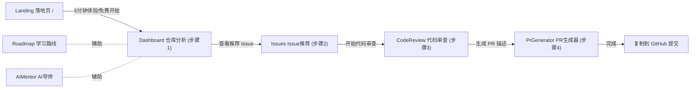

# OpenSource Mentor 项目评审报告书

> 本报告为只读代码评审的总结归纳，覆盖产品流程与工程实现两个维度。评审基于对前端 7 个页面、7 个 Zustand store、前端 services 层，以及后端 BFF（controllers / services / middlewares / config / nginx）的完整通读。

---

## 一、项目概述

- **定位**：AI 开源贡献导师，帮助新人完成「看懂项目 → 选 Issue → 理解 Issue → 审查代码 → 生成 PR」的完整链路。
- **技术栈**：
  - 前端：React 18 + TypeScript + Vite + Zustand
  - 后端：Express + TypeScript + Zod（BFF 模式）
  - 外部能力：DeepSeek 兼容 LLM + GitHub REST API
  - 部署：Docker + Nginx
- **规模**：7 个页面（1 落地 + 6 应用）、8 类后端接口、6 个 AI 能力、7 个业务 store。

---

## 二、用户流程与页面关系

### 2.1 设计意图的主流程

产品存在「主漏斗」与「辅助工具」两条并行流程。主漏斗由 `NextStepCard` 串联：

### 2.2 每个页面解决的问题

| 页面 | 路由 | 解决的问题 |
|------|------|-----------|
| Landing | `/` | 讲清价值主张与痛点，转化访客进入应用 |
| Dashboard（仓库分析） | `/dashboard` | 输入仓库 → AI 给出概览、难度、新手友好度、推荐 Issue 预览（漏斗顶端、最核心一屏） |
| Issues（Issue 推荐） | `/issues` | 完整 Issue 列表 + 筛选排序 +「为什么推荐」深度解析 |
| CodeReview（代码审查） | `/code-review` | 针对某 Issue 提交 PR 链接，AI 多维度审查 |
| PrGenerator（PR 生成器） | `/pr-generator` | 根据类型 + 改动描述生成规范 PR 标题/描述 |
| Roadmap（学习路线） | `/roadmap` | 按用户水平生成分阶段学习路径 + 进度追踪 |
| AiMentor（AI 导师） | `/ai-mentor` | 自由问答（技术栈、贡献方式、Issue、规范等） |

### 2.3 最核心的用户路径

**输入 GitHub 仓库 → AI 分析（难度/友好度/技术栈）→ 推荐可上手 Issue → 理解该 Issue 怎么做**。

理由：对应 README 反复强调的核心痛点；是唯一「零门槛即可体验且立即产生价值」的部分（默认自动分析 vscode）；后半段（CodeReview/PrGenerator）需用户已写好代码，属低频后置环节。

---

## 三、产品维度评审

### 3.1 首次进入流程是否清晰？——部分清晰，存在自相矛盾

- **优点**：Landing 所有 CTA 指向 `/dashboard`，Dashboard 挂载时自动分析默认仓库 `microsoft/vscode`，新用户零输入即见价值，无空状态尴尬。
- **问题 1 · 四步定义打架**：onboarding 卡片写「仓库分析 → Issue → 代码审查 → 学习路线」，但 `NextStepCard` 实际第 4 步是 PR 生成器。
- **问题 2 · 导航无强引导**：侧边栏 6 入口平铺 + 一个死链「偏好设置」（无路由），未强制 1→2→3→4；学习路线/AI 导师何时用不明确。
- **问题 3 · CodeReview 前置矛盾**：要求用户已有 PR 链接，对「尚未迈出第一步」的目标新人矛盾，只能靠预设的 vscode 假 PR 走过场。

### 3.2 AI 功能之间是否割裂？——明显割裂

- 6 个 AI 能力（analyze / recommend / explain / roadmap / chat / reviewPr）后端各自独立，不共享上下文。`chat` 每次仅带一个 systemPrompt，读不到 analyze / recommend 的结论。
- `AiMentor` 与其它页高度重叠：快捷问题即「有哪些适合新手的 Issue」「技术栈是什么」，与 Issues / Dashboard 重复。
- `chat` 返回的 `relatedIssues` / `suggestedNextSteps`、`roadmap` 各阶段的 `recommendedIssues` 前端**均未渲染**，AI 产出被丢弃，形成数据孤岛。

### 3.3 重复功能与伪需求（低优先级）

**重复功能**
1. Issue 推荐同一份数据在 3 处渲染：Dashboard 预览、Issues 列表、CodeReview 空状态 Top5。
2. AI 问答能力重叠：AiMentor、IssueExplainModal、CodeReview 建议本质都是「AI 回答关于仓库的问题」。
3. 仓库上下文（owner/repo）在 4 个 store 各存一份。
4. 难度推导/标签逻辑在 Dashboard、Issues、CodeReview 各写一遍。
5. 图标组件（CodeIcon/SparklesIcon 等）在几乎每个页面重复定义。
6. 两套「进度/引导」概念并存：NextStepCard vs Roadmap。

**伪需求 / 摆设**
- 「个性化推荐」为伪个性化：`user.profile` 恒为空、无技能录入入口，却宣称「基于技能栈匹配」。
- 「偏好设置」侧边栏死链。
- AppHeader 搜索/通知/帮助按钮未接回调，纯装饰（含假通知红点）。
- Landing 假社会证明（"加入数万名开发者"）与恒为上升的假趋势箭头。
- CodeReview「粘贴 Diff / 上传文件」代码内明标「未完成」。
- Roadmap 学习进度为纯前端本地状态，刷新即丢。

---

## 四、工程维度评审

### 4.1 是否存在重复的 API 调用？——严重重复，且无缓存

- 后端每个 AI 接口都各自重新 `githubService.getRepository()`（analyze / recommend / generate-pr / generate-roadmap / chat 全部）。
- 前端一次 Dashboard 加载并发 `analyzeRepo` + `loadRecommendedIssues`，同一 repo 的 `getRepository` 一次页面加载至少调用 2 次；进入 Roadmap 再来一次；**chat 每发一条消息都重拉一次**。
- Issues 与 CodeReview 空状态各自 `loadRecommendedIssues`，同一推荐可能重复请求。
- 后端**无任何缓存层**，GitHub/LLM 每次都真打，叠加下方「无鉴权」会放大成本与限流风险。

### 4.2 状态管理是否合理？——基本合理，但有真实 bug

- **优点**：Zustand 分域清晰；`repository` store 做了 localStorage 持久化。
- **核心 bug**：仓库上下文在 4 个 store 各存一份，`pr` store 的 `setCurrentRepository` **从未被调用**，导致 PR 生成器顶栏永远显示 `microsoft/vscode`，与实际分析仓库脱节。
- `chat`/`roadmap` 靠各页 `useEffect` 手工同步 owner/repo，易漂移。
- `user.profile` 永远是空默认值，无写入入口，却驱动侧边栏「贡献者等级」显示。
- `codeReview` 用 `setInterval` 轮询并把 timer 存进全局 store，副作用入 store 不够干净。

### 4.3 前后端职责是否清晰？——BFF 分层总体清晰，有漏点

- **好**：标准 BFF，前端 services 只调 `/api`，后端聚合 GitHub + LLM，DTO 在后端归一。
- **漏点 1**：前端仍保留 GitHub axios 实例 + `VITE_GITHUB_TOKEN` 请求拦截器，但全站无人使用——死代码 + 安全误导。
- **漏点 2**：职责不一致。analyze/recommend/roadmap/chat 都在后端取仓库信息，唯独 `explain` 让前端先调 `/repository` 再把 repo 塞进 `/ai/explain` body，多一次往返。
- **漏点 3**：DTO 在前后端各映射一遍，维护成本翻倍。

### 4.4 Mock 与真实 API 模式是否一致？——不一致，且文档误导

- **文档谎报**：README 称「保持 `VITE_USE_MOCK=true` 无需密钥即可体验全部界面」，但前端从未读取 `VITE_USE_MOCK`；真正的 mock 在后端（无 LLM key 时走 mock）。
- **GitHub 调用永不 mock**：即使没有 LLM key，`analyze-repo` 仍先 `getRepository`，无 `GITHUB_TOKEN` 时匿名调用易 403 限流，在 AI mock 之前就失败——「无密钥体验全部界面」实际做不到。
- **dev/prod 降级不同**：LLM 报错时 development 回退 mock，production 直接抛 503。
- `reviewPr` 无论有无 key 都走 mock，与其它 AI 功能不一致。

### 4.5 安全问题

| 级别 | 问题 | 说明 |
|------|------|------|
| 高危 | 无鉴权 / 无限流 / CORS 全开 | `app.use(cors())` 允许任意源，所有 `/api` 无认证，**LLM key 与 GitHub token 额度可被任意盗刷** |
| 高危 | 密钥前端化脚枪 | `VITE_GITHUB_TOKEN` 会打进前端 bundle，一旦配置即公开泄露（当前未使用但存在隐患） |
| 中 | 路径未编码 | owner/repo/pullNumber 直接拼进 GitHub URL，未 `encodeURIComponent` |
| 中 | 上游错误透传 | GitHubError 把 `details` / `documentation_url` 透传前端，信息披露 |
| 低 | Prompt 注入 | README / issue body / PR diff 原样进入 LLM prompt，恶意仓库可操纵输出 |
| 低 | 明文 HTTP 部署 | nginx 仅 listen 80，Demo 走 8082，无 HTTPS |

### 4.6 影响未来扩展的点

- 审查任务用内存 Map：重启即丢、无法水平扩展、进度是「按时间估算」的假进度。
- 无持久化：roadmap 进度、chat 记录、user profile 全在内存/localStorage。
- 无用户体系：UI 处处暗示「个性化/贡献等级」，但无登录、无 profile 写入。
- `aiService.ts` 单文件 1900+ 行：mock / real / validate / PR 审查混杂，`reviewPr` 真实分支仍是 TODO。
- 仓库上下文四处复制：新增页面就要再同步一份（已因此出 bug）。
- chat 命名为 streaming 实为一次性请求，未来接流式需改数据流。
- 无自动化测试；前端图标/难度逻辑大量复制粘贴。

---

## 五、问题清单（按优先级）

### P0 — 上线前必须处理
1. 后端接口无鉴权 + 密钥可被盗刷 → 加最简 API key/来源校验 + 限流（`express-rate-limit`）+ 收紧 CORS。
2. `pr` store 仓库上下文不同步导致 PR 生成器用错仓库 → 统一仓库上下文来源。
3. 文档与实现不符（`VITE_USE_MOCK`、"无 key 全体验"）→ 修文档或补实现。

### P1 — 体验与成本
4. `getRepository` 重复调用无缓存 → BFF 层加短 TTL 缓存（内存/LRU）。
5. AI 输出被丢弃（relatedIssues / roadmap issues / suggestedNextSteps）→ 前端渲染并打通跳转。
6. 「四步流程」定义统一 + 导航强引导（明确主路径 vs 辅助工具）。

### P2 — 一致性与可维护
7. `reviewPr` 真实分支缺失 → 补齐或明确标注 Demo。
8. 前端 GitHub 直连死代码、DTO 双重映射、图标/难度逻辑重复 → 清理与抽公共模块。
9. 审查任务内存态、无持久化、无用户体系 → 引入存储层（DB/Redis）与登录。
10. 拆分 1900 行 `aiService.ts`（mock / real / validate 分离）。

---

## 六、核心收敛建议

- **明确唯一主路径**：仓库分析 → Issue 推荐 → Issue 深解；把 CodeReview / PrGenerator 降为「进阶工具」，AiMentor 收敛为贯穿式侧边助手而非独立重复入口。
- **统一上下文 + 缓存**：单一 `repositoryContext` 源 + BFF 缓存，一次分析结果供所有 AI 能力复用（同时解决割裂与重复调用）。
- **安全基线**：鉴权 + 限流 + CORS 白名单 + 错误脱敏，作为任何真实部署的前置条件。
