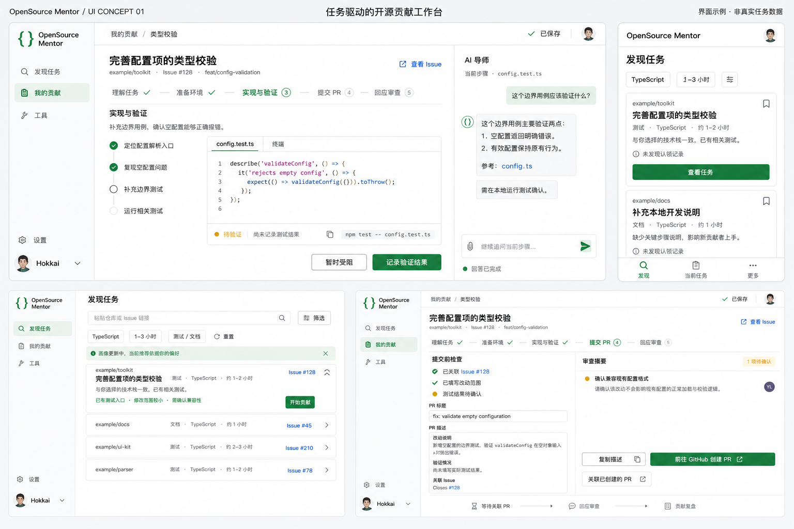

# OpenSource Mentor UI / UX 设计稿 01

日期：2026-09-07。交付：静态高保真概念稿及交互说明，不涉及产品代码或部署。

## 设计方向

以当前贡献任务为中心，采用白色和浅灰阅读界面、深色正文、绿色主操作、蓝色来源链接和琥珀色待确认状态。桌面保留紧凑侧栏；手机保留发现、当前任务、更多三个入口。品牌暂以绿色括号图形表达代码与导师关系，作为本轮视觉探索，不代表正式替换现有品牌。

主操作直接对应用户当前目标。任务标题、阶段、上下文和保存状态始终清晰可见。聊天嵌入任务工作区，减少反复跳页。

## 1. 发现任务

- 初次进入使用偏好加载候选；画像仍在生成时展示非阻塞提示，用户可以继续浏览。
- 搜索支持仓库和 Issue 链接；筛选支持技术、时间和贡献类型。修改筛选后保留已有内容并显示更新状态，成功后替换结果。
- 点击任务标题或展开箭头，展示具体匹配理由、改动范围、参与状态及来源；收藏图标独立操作，不触发展开。
- “开始贡献”先刷新 Issue 状态。若已关闭、已分配或出现认领信号，展示变化和可选行动；通过核查后建立本地产品任务并进入工作区。该动作不代表向 GitHub 发起认领。
- 后台分析更新不会自动移动用户正在阅读的行；允许用户主动按最新匹配重新排序。
- 空列表提供清除筛选和输入指定 Issue 两种恢复入口；部分分析失败保留原始任务并提供单项重试。

## 2. 当前贡献工作区

- 顶栏固定显示仓库、Issue 和当前分支；未关联分支时显示“关联分支”，不伪造默认值。
- 阶段导航允许返回已完成步骤；跳过步骤标注“已跳过”，不显示为验证通过。
- 步骤列表承载具体动作；正文显示操作、相关代码和预期结果。代码面板为参考内容，图中的“终端”用于展示命令与用户记录，不表示网页已具备远程执行能力。
- “记录验证结果”打开侧面表单：命令、结果、可选输出片段。保存后标记“用户记录”；只有接入可核实的执行结果时才标记自动验证。
- “暂时受阻”允许输入障碍并保存任务；可以将用户选择的信息带入导师，不自动发送全部代码或日志。
- “已保存”仅在保存完成后显示，另有保存中、同步失败、本地已保存三种状态。失败时保留输入并提供重试。

## 3. AI 导师

- 输入框上方展示本次携带的任务、步骤和文件引用，用户可移除不需要的上下文。
- 发送后先显示处理中，首段到达后逐步呈现；发送按钮在生成期间变为停止按钮。
- 停止或失败保留已有回复；重试作用于当前消息，避免重复加入用户消息。
- 回复使用结构化段落、代码块及可打开的来源。未读取的源码只能作为待核实建议，不生成虚假的文件引用。
- 手机从当前任务进入导师全屏视图，返回时恢复原步骤和阅读位置。

## 4. 提交与反馈

- PR 标题与描述可编辑，区分实际改动、已经执行的验证和尚未确认的事项。
- “复制描述”等待剪贴板操作成功后提示；失败时保留可选文本。
- “前往 GitHub 创建 PR”只有在目标仓库及比较分支已确认时才进入对应页面；缺失时先引导关联。打开 GitHub 不代表 PR 已创建。
- “关联已创建的 PR”接收链接并核对仓库；关联成功后才进入回应审查阶段。
- 测试结果未记录时保持待确认状态，可继续整理草稿；不能自动声明测试通过。
- 反馈页区分等待维护者、需要修改、已合并和已关闭，附最后核查时间；未联网时保留上次结果并说明时效。

## 5. 移动端与无障碍

- 首屏直接呈现第一条任务的标题、时间、理由和操作，减少说明性文案。
- 筛选使用底部面板；更多入口包含工具、设置和账户状态，不依赖横向滚动发现。
- 交互目标建议至少 44 × 44 CSS 像素。长标题换行，代码区域独立横向滚动，正文不出现横向滚动。
- 导航为语义链接，图标按钮有可访问名称；弹层管理初始焦点、焦点范围和关闭后恢复位置。
- 生成完成和错误状态可供辅助技术感知，但不逐 token 播报整段内容。

## 视觉稿评审边界

图中仓库、任务、用户操作结果均为示例。图像用于评审整体布局和视觉方向，精确文字与交互以本文为准。下轮细化需补齐：发现页未展开行的完整任务标题；提交页在测试待确认时不得把“实现与验证”画成已验证完成；审查区域不要出现可能误解为真实审查人的示例头像。代码、命令和小字需在正式组件稿中逐项核对。

本版尚未制作可点击原型，也未通过真实用户测试。下一轮应验证选择任务、受阻求助、离开恢复、提交交接四条交互路径。
