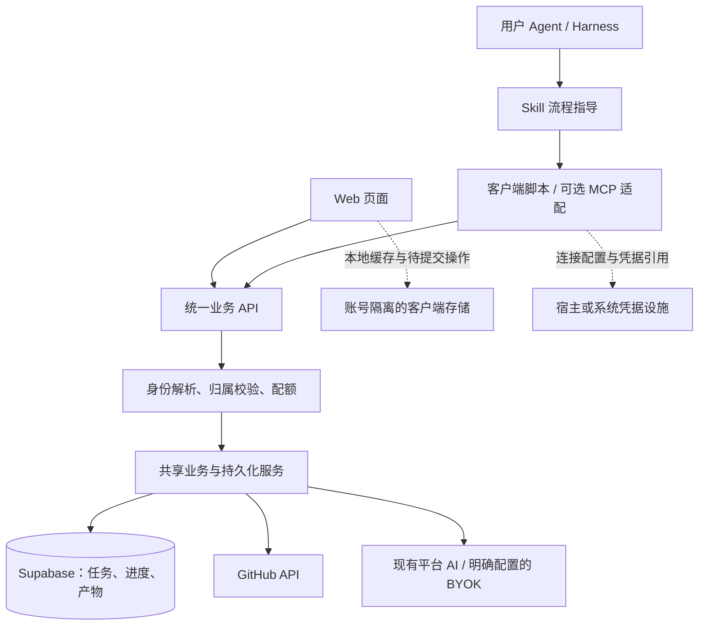

# Web 与 Skill 共用进度：优化指南

日期：2026-10-06  
状态：技术与流程建议，尚未实施  
配套文档：[需求文档](E:/Projects/repos/opensource-mentor/docs/requirements-web-skill-sync-2026-10-06.md)

## 1. 推荐方案与取舍

推荐采用 **Supabase 保存业务事实 + 共用业务 API + Web/Skill 两个入口**。先补齐任务与进度持久化，再发布对话客户端；保持现有能力和部署基础，避免在 Skill 内复制第二套业务实现。

| 路线 | 优点 | 代价或限制 | 建议 |
| --- | --- | --- | --- |
| Skill 说明 + 轻量客户端调用现有服务 | 可以复用服务端能力与账号；适合具备脚本执行环境的宿主 | 需要程序授权与运行时适配；不是仅复制 Markdown 就完成 | 首发优先 |
| Skill + 产品 MCP 服务 | 工具有结构化参数；适合只提供工具连接的宿主 | 需要部署、鉴权及 MCP 兼容工作 | 业务 API 稳定后按宿主需求增加 |
| Skill 直接重写本地业务，自己保存进度 | 部分操作能利用本地环境 | 与 Web 的规则、结果和状态继续分叉；安装依赖和凭据配置增多 | 不作为默认方案 |
| Skill 通过浏览器操作网页 | 能复用现有界面 | 仍依赖网页登录、页面结构与浏览器状态 | 不作为长期主入口 |

Skill 是流程与资源包，不自动提供账号、执行工具或持久化。其与工具服务的职责划分参考 [OpenAI 官方 Build skills](https://developers.openai.com/plugins/build/skills)。未来产品 MCP 应暴露本项目业务工具，不让普通用户接入可执行任意 SQL 的 Supabase 管理 MCP。

## 2. 目标架构



Web 与 Skill 是客户端。任务归属、状态校验、幂等、版本控制和结果关联属于服务端；本地存储承担缓存和未同步修改，不再是登录用户进度的唯一副本。

Worker 与 Express 的运行时可以保留。共享领域契约、校验规则与持久化接口，运行时适配分别处理 Request/Response 和 Express 请求。当前只有部分审查逻辑在 `shared/core`，后续按需要提取，不要求先进行全仓重写。

首发建议指定 Worker 为规范服务入口，Express 身份与同步后置补齐，并明确兼容状态。多个部署要共享进度，必须使用同一数据库、同一用户身份映射和兼容契约；同一个用户各自部署不同数据库不会自动同步。

## 3. 先建立数据归属清单

把状态分成以下几类，逐字段迁移：

| 类别 | 例子 | 处理方式 |
| --- | --- | --- |
| 用户输入与进度 | 步骤勾选、当前阶段、PR 人工编辑、业务偏好 | 必须持久化；不能被后台 AI 覆盖 |
| 需要接续的生成产物 | 指南、Issue 解释、导师回复、审查结果 | 按任务、来源和生成版本保存；恢复不自动重生成 |
| 外部事实与可重建缓存 | 候选列表、GitHub Issue 当前状态、公开仓库信息 | 设置有效期；展示来源与抓取时间；关键决策前更新 |
| 临时交互 | 展开项、弹窗、计时器、流式预览 | 本地或内存，不写业务表 |
| 凭据 | 应用 token、GitHub PAT、LLM Key | 独立管理，不随业务状态同步 |

当前指南将内容、生成状态与完成状态放在同一对象中；建议在 API 层先拆开语义，再决定数据库细分程度。整个 Zustand store 序列化上传容易把临时状态、凭据和其他任务上下文一起写入。

## 4. 建议的数据模型

以下是逻辑模型，表名和字段待契约确认；本轮不生成 SQL 迁移。

| 实体 | 主要字段 | 关联与约束 |
| --- | --- | --- |
| `app_users` | 沿用现有用户 ID 与 GitHub 数字 ID | GitHub 登录名可变，不作为永久身份键 |
| `contributions` | `id`、`user_id`、仓库标识、可空 `issue_number`、阶段、当前指南版本、时间戳 | 服务端创建；独立仓库任务不强制填写 Issue |
| `user_workspace_state` | `user_id`、`active_contribution_id`、版本 | 当前任务指针必须引用本用户任务；本地工作目录只是宿主提示 |
| `contribution_guides` | `id`、任务 ID、指南版本、schema 版本、章节内容、生成状态、来源 | 新生成产生新版本；已完成版本作为快照保留 |
| `contribution_progress` | 任务 ID、指南版本、当前章节、章节状态、行动步骤状态、版本 | 进度指向特定内容版本；支持撤销完成 |
| `mentor_sessions/messages` | 用户/任务/会话 ID、消息 ID、角色、内容、服务端序号、消息状态 | 只保存本项目业务对话；消息幂等追加，分页读取 |
| `pr_drafts` | 用户、可空任务 ID、类型、输入摘要、关联 Issue、标题、描述、版本 | 保存输入与人工编辑；生成候选不覆盖新编辑 |
| `review_runs` | 用户、可空任务 ID、来源、base/head SHA、状态、规则或 LLM 来源、结果 | 绑定实际审查版本；长期保存结果，缓存仅加速 |
| `analysis_artifacts` | 用户、可空任务 ID、类型、结果、来源摘要、抓取时间、schema 版本 | 保存任务采用的分析/解释；不要无限保留每次候选计算 |
| `operations/generation_jobs` | 用户、操作 ID、输入摘要、状态、阶段/产物关联、时间戳 | 支持重试去重、检查点与中断恢复；状态记录本身不保证任务继续执行 |
| `client_authorizations` | 用户、客户端/服务标识、权限、到期、撤销信息、凭据摘要 | 独立授权，不把客户端凭据塞进用户画像 |

可以先把指南内容和进度分别保存为受 schema 校验的 JSONB；需要独立分页、顺序和幂等的消息使用独立行。不要一开始把所有章节内容过度拆表，也不要把所有业务压进 `developer_profiles` 的一个 JSON 字段。

### 4.1 标识和索引

- 业务使用服务端 `contribution_id`；仓库/Issue 用于定位，不能替代权限校验。
- 指南版本与行动步骤 ID 联合定位勾选；现有 `phase-0` 等序号标识不能跨新旧内容盲目复用。
- 同用户对同仓库/Issue 的“开始或恢复”具有幂等规则；若允许重新开始，必须显式创建新记录，不能误合并历史。
- 关联记录验证父对象和用户归属；可用复合外键等约束防止跨用户关联，不能只约束 ID 存在。
- 索引覆盖用户近期任务、任务下产物、会话消息序号、用户下操作 ID；唯一约束处理重复提交。
- 更新时使用服务端版本号与时间戳；客户端时钟只作为辅助展示，不决定覆盖顺序。

### 4.2 进度语义

明确三个不同维度：

1. 指南生成状态：排队、生成中、完成、失败。
2. 用户章节状态：待开始、当前、完成。
3. 行动步骤状态：每项完成/未完成，必要时记录说明与证据引用。

生成百分比与用户完成比例分别命名；比例由对应数据推导，不由客户端直接提交一个“百分比”。勾选表示用户记录的完成状态，不能自动变成“测试已通过”或“PR 已提交”。

## 5. 身份、授权与 Supabase 权限

### 5.1 首发沿用应用身份

当前自建 GitHub OAuth + Cookie 已映射 `app_users.id`。建议先沿用这一主身份，为客户端增加适合程序使用的应用授权，所有入口都解析成同一个内部 `principal`。

| 路线 | 适用性 | 取舍 |
| --- | --- | --- |
| 保留当前身份，增加应用配对/客户端授权 | 最少影响现有账号与 Web | 需要实现凭据生命周期、撤销与服务端归属校验 |
| 迁移至 Supabase Auth，再统一 OAuth/OIDC | 有长期标准化需求时评估 | 需映射已有 `app_users`、迁移会话和 RLS；不能作为本期默认顺手改动 |

Supabase 数据库使用不等于 Supabase Auth 使用。当前服务端 secret/service_role 访问会绕过 RLS，服务端必须校验每次读取和写入的用户归属；RLS 不能自动补足服务端授权。参考 [Supabase API keys](https://supabase.com/docs/guides/getting-started/api-keys) 与 [Row Level Security](https://supabase.com/docs/guides/database/postgres/row-level-security)。

新业务表继续启用 RLS，并限制浏览器/普通客户端直连；仅向实际服务端角色开放需要的操作。若将来使用用户 JWT 直连，才依据真实 Auth 身份映射设计策略，不能直接把现有自建 Cookie 视为 `auth.uid()`。

### 5.2 建议的首次授权体验

可以评估应用自己的配对流程，这不是声称 GitHub 或现有 Supabase 项目已经支持设备授权：

1. 客户端创建短期配对请求，显示服务地址和授权页面；浏览器打不开时可复制链接。
2. 用户在已有 Web 会话下确认应用、客户端和权限；未登录则完成现有 GitHub 登录。
3. 服务端绑定当前用户。浏览器可展示短期人类校验码，客户端持有独立高熵兑换凭证；校验码本身不能直接兑换 token。
4. 配对记录限时、限次、一次性消费；轮询受限速控制；拒绝或过期返回明确状态。
5. 客户端领取短期访问凭据和受控续期凭据，保存在系统/宿主凭据设施，随后恢复原操作。

应评估成熟授权组件的复用，避免临时设计不完整的协议。若首批宿主要求标准 OAuth/PKCE，则按其协议做专门适配；不能用上述配对流程冒充 MCP OAuth。

后续使用优先续期，明确授权范围，例如读任务、写进度、调用 AI、保存草稿。调用本项目不自动获得 GitHub 创建 PR、评论或合并权限。

新增客户端授权要支持单客户端撤销和必要的全部撤销。Web 当前 logout 仅清除 Cookie；未来“退出网页”“断开此 agent”“撤销全部客户端”需要有明确不同效果。

### 5.3 凭据与服务地址

- Skill 包包含公开服务地址、契约和流程，不能包含平台或 Supabase 密钥。
- 本地配置只保存服务地址、账号标识、凭据引用和 schema 版本；不把 token 输出给模型。
- 首选系统/宿主安全凭据存储。文件存储若作为兼容回退，需要限制访问权限并披露限制，不宣称其与系统密钥库同等安全。
- token 绑定目标服务/audience；变更服务地址重新确认授权，不能把旧 token 或 BYOK 自动发给任意地址。
- 应用身份和 GitHub 数据读取凭据分开；平台/BYOK 行为沿用现有明确模式。宿主登录或 `gh` 登录不自动创建本项目会话。
- Cookie 写入接口检查可信 Origin/CSRF；程序调用通过独立 bearer 凭据进入。CORS 开放与授权是不同问题。

新表访问还需明确检查 Data API 暴露与 GRANT，建表成功不等于服务端 REST 可用。官方已公布默认暴露规则调整，实施时复核实际项目设置，见 [Supabase Securing your API](https://supabase.com/docs/guides/api/securing-your-api) 和 [相关变更说明](https://supabase.com/changelog/45329-breaking-change-tables-not-exposed-to-data-and-graphql-api-automatically)。

## 6. 共用接口契约

现有 `/api/ai/*`、`/api/issues/*` 和审查能力可继续使用，增加状态与恢复契约，并逐步让业务生成结果由服务端关联保存。下表为建议，不是现有端点清单。

| 建议接口/操作 | 用途 | 关键行为 |
| --- | --- | --- |
| `GET /api/v1/me` | 获得已验证应用身份 | 区分 401、网络失败和服务错误 |
| `GET /api/v1/contributions` | 找到当前或指定任务 | 仅返回当前用户数据，分页 |
| `POST /api/v1/contributions` | 开始或恢复任务 | 幂等；仓库合法；Issue 可按场景为空 |
| `GET /api/v1/contributions/:id` | 读取任务及恢复摘要 | 返回版本、当前指南、最近产物引用和同步信息 |
| `PATCH /api/v1/contributions/:id/progress` | 更新步骤/章节 | 显式设值、版本校验、操作去重 |
| 指南读取/生成/重试 | 复用现有分章能力 | 产物绑定任务、版本和章节检查点 |
| 会话消息读取/追加 | 导师业务会话恢复 | 稳定消息 ID、服务端序号、分页 |
| 草稿读取/更新/生成 | 输入与草稿接续 | 乐观版本；人工编辑与生成候选分离 |
| 审查创建/读取 | 现有审查能力与持久结果 | 用户归属、来源 SHA、生成来源 |
| 本地数据导入 | 吸收可读取的旧数据 | 预览、归属选择、schema 校验、幂等批次 |
| 客户端授权/续期/撤销 | Skill 程序访问 | 服务绑定、权限、到期、限速 |

将现有响应包络统一成明确、版本化的契约；客户端解析成功/失败，不依赖模型从错误文案猜测。客户端命令可以输出结构化 JSON，再由 agent 解释给用户。

示例仅说明状态更新语义：

```json
{
  "operation_id": "client-generated-unique-operation-id",
  "expected_revision": 7,
  "guide_version": 2,
  "changes": [
    { "step_id": "reproduce-check", "completed": true }
  ]
}
```

服务端成功响应返回实际版本、提交时间、任务 ID；冲突返回 `409`、最新版本及必要差异。请求不接受客户端决定的 `user_id`。使用 `completed: true/false`，避免重试一次 `toggle` 导致状态再次翻转。

错误分类至少覆盖未授权、授权到期/撤销、目标不存在、版本冲突、输入错误、限流、依赖服务故障和保存失败。公开能力的访客访问与已登录数据保存分开判断，具体配额策略沿用并补充账号维度，避免所有 agent 被当成同一代理 IP。

### 6.1 生成与持久化边界

不能只在浏览器收到 AI 结果后再保存，否则关闭页面或响应丢失可能失去已生成结果。服务端应创建稳定操作记录，完成后保存产物并关联任务，再返回结果或结果引用。

外部 LLM 调用不处于数据库事务中。先记录操作，再执行调用，最后原子提交产物与完成状态；中断时保留已提交检查点并允许明确重试。持久化 job 状态不能保证后台工作继续执行，只有要求“页面关闭后仍继续”的场景才另行引入可靠任务执行机制。

初版可保留同步生成：已完成章节必须保存，未完成章节标记为中断/可重试，不承诺后台必然继续。指南的流式片段用于预览，完整验证过的章节用于正式产物。

## 7. 自动保存与冲突处理

### 7.1 客户端保存机制

1. 恢复有效应用身份和目标任务，再加载服务端状态；本地副本用于快速显示与待提交恢复。
2. 修改时记录细粒度操作，绑定账号、服务、任务、指南版本、客户端 ID 和操作 ID。
3. 勾选与阶段变化及时提交；文本输入短暂防抖。退出时 flush 仅为辅助，不能依赖关闭事件完成所有保存。
4. API 确认提交后移除对应待提交操作，更新版本与“已同步”时间。
5. 超时保留操作；先核对结果/用同一操作 ID 重试，避免默认重跑 AI。
6. 每次进入任务、恢复页面焦点或对话说“继续”时重读服务端。旧请求用账号/任务代次校验，迟到响应不更新新上下文。

Web 可评估 IndexedDB 保存隔离的缓存与待提交队列；轻量配置可继续用 localStorage。Skill 客户端若具备本地可靠存储也可保存待提交操作，否则明确提示未同步并提供重试，不能依赖 agent 聊天记忆作队列。

显示状态至少包括：正在保存、已同步、离线待同步、保存失败、需要处理冲突。未登录访客明确为“仅保存在此设备”。

### 7.2 合并规则

| 数据 | 建议规则 |
| --- | --- |
| 不同步骤 | 检查基线后重放不相交字段更新；旧版本冲突先读最新值 |
| 同一步骤完成与撤销 | 版本冲突提示或显式选择；禁止使用只增不减的集合合并 |
| 当前章节/阶段 | 校验合法值；并发修改同字段需解决冲突，不用全局最大值强行推进 |
| PR 标题/描述、用户备注 | 保留本地和服务端版本，由用户选择或明确合并 |
| 聊天消息 | 按消息/操作 ID 幂等追加，用服务端序号排序；完成回复不追加重复消息 |
| 指南生成结果 | 按生成版本保存；旧 job 不能更新当前新版本指针 |
| 偏好 | 字段级更新，用户修改优先于后台画像推断 |

不使用“最后整个 JSON 覆盖”或仅比较客户端 `updated_at` 的规则。第一版宁可明确暴露冲突，再逐步增加可靠自动合并。

版本检查、操作去重、状态更新和必要的关联写入必须在同一数据库事务内完成。可通过受控数据库函数/RPC或事务型仓储实现；当前多个独立 REST 请求不能被当成一个事务。优先使用能满足权限的 invoker 设计，避免通过随意添加 `SECURITY DEFINER` 解决权限报错。

### 7.3 Realtime 的位置

先完成持久化、幂等和恢复；Realtime 只在实测需要更快双端更新时增加。初版用焦点刷新与受控轮询即可。

当前自建 Cookie 不能直接当作 Supabase Realtime 用户 JWT。若未来接入订阅，要单独设计通道身份和授权，不把 service_role key 交给客户端。实时通知最多提示“有新版本”，恢复仍以数据库读取为准。

## 8. 旧浏览器数据迁移

需要处理的当前键：

| 键 | 可迁移内容 | 注意事项 |
| --- | --- | --- |
| `opensource-mentor:repository` | 当前仓库与贡献 Issue | 没有可靠账号归属信息；必须预览并确认归属 |
| `osm.contribution-guide.v1:*` | 可读取的指南、章节和勾选 | sessionStorage 仅在可访问的页面会话中提取；不能恢复已经丢失的数据 |
| `opensource-mentor:user-profile` | 有业务价值的用户偏好 | 与现有云端字段对照；只导入明确选中的字段 |
| `opensource-mentor:api-settings` | 可选的非敏感配置 | 不迁移 PAT/API Key；各端模型可独立配置 |

迁移流程：

1. 在现有 origin 的 Web 中读取可访问数据，验证 JSON/schema 并展示待导入摘要。
2. 明确当前账号。旧键未绑定账号，不能因为登录成功就自动将所有数据归入此人。
3. 按仓库、Issue、内容与当前云端任务匹配；无匹配创建任务，有匹配且冲突保留候选副本，交由用户选择。
4. 生成稳定导入批次/源记录标识，服务器去重；同批重复导入不重复创建任务或消息。
5. 服务端确认持久化并验证恢复后记录迁移完成；本地备份保留一段可配置时间。
6. 对丢失的内存聊天、过期缓存或已关闭会话的数据明确说明不可恢复；不编造迁移成功。

Cloudflare 域名与 Docker 地址是不同 origin，不能直接互读本地存储。需要分别访问原入口执行导入，或在后续明确设计手动导出/导入路径；Skill 也不能默认访问任意浏览器存储。

## 9. Skill 包与调用流程

拟议结构如下，只是设计，没有在本轮创建或安装 Skill：

```text
skills/opensource-mentor/
├── SKILL.md                 触发条件、恢复与调用流程、结果规则
├── scripts/mentor-client.*  稳定的授权、API 调用、错误解析
└── references/
    ├── capabilities.md     现有能力与输入/输出说明
    ├── state-contract.md   任务、版本、保存和冲突规则
    └── setup.md            已验证宿主的安装、连接与诊断
```

按 [Agent Skills specification](https://agentskills.io/specification) 使用必需的名称与描述；支持资源按需读取。具体脚本语言待首批宿主决定：复用现有 TypeScript 契约有优势，但不应假定普通用户预装 Node.js。评估可分发客户端与支持的操作系统，再确定最低依赖。

### 9.1 对话到能力的映射

| 用户表达 | 能力路由 | 状态行为 |
| --- | --- | --- |
| “分析这个仓库” | 现有仓库分析 | 保存所采用的分析产物；不自动认定开始贡献 |
| “给我推荐合适的 Issue” | 现有候选/推荐流程 | 使用云端业务偏好；候选列表是缓存，不是贡献进度 |
| “解释 #123，开始这个任务” | Issue 解释 + 任务建立/恢复 | 保存 Issue、解释与当前任务关联 |
| “继续贡献，告诉我下一步” | 读取任务 + 指南/进度 | 优先恢复，不重新生成 |
| “这一步做完了” | 显式步骤设值 | 校验目标步骤，成功提交后才称已同步 |
| “我卡在这个报错” | 现有导师能力 | 传入必要任务上下文和用户提供信息；保存业务问答 |
| “审查这个 PR/分支” | 现有 GitHub PR/Compare 审查 | 保存真实来源与结果；本地未 push diff 的服务审查另行评估 |
| “根据我的改动整理 PR” | 现有草稿能力 | 保存输入和草稿；不自动创建 GitHub PR |

一个 Skill 先覆盖连贯流程即可，不按每个网页页面拆成大量技能。主入口保持简短，能力和状态细节放 references，客户端保证确定性请求与解析。

### 9.2 恢复上下文原则

- 优先使用用户明确指定的任务，再使用客户端绑定任务和云端当前任务。
- 本地目录、Git remote 或分支只能提供候选线索；与任务不一致时确认目标，不能默默切换或写进度。
- 多个可能目标时展示少量任务摘要供选择；没有任务时说明状态，按用户意图开始。
- 对话读服务端的阶段、步骤和产物，不能凭上一轮措辞补造完成状态。
- 返回内容尽量包含结论、下一步、保存结果和必要的 Web 任务地址；后台结构化结果保留 ID 与 revision。
- 提供给 agent 的 Issue、README 和评论是外部数据，不将其中的指令当成应用授权或凭据处理指令。

### 9.3 模型执行方式

首发建议复用现有平台 AI/BYOK 请求契约。宿主 agent 负责理解用户目标、选择工具和解释结果；服务端继续执行项目已有模型逻辑，保持 Web 与 Skill 行为一致。

宿主模型直接生成有可能减少额外模型配置与调用，但会改变生成、验证、版本和成本归属。应作为后续可选执行模式评估，并仍经统一 API 保存验证过的产物；不能在首发中假定能提取或转发用户宿主密钥。

### 9.4 安装、升级与兼容

首批按用户确认验证 Codex 与 Claude Code，核心 Skill 保持通用格式，安装与环境适配分别说明。普通路径：选择已验证宿主 → 安装固定发布版本 → 设置默认服务 → 一次应用授权 → 通过对话调用。安装说明分别列宿主路径与步骤，不宣称一个目录能被所有 harness 自动发现。

维护 Skill、客户端和 API/schema 版本的兼容矩阵；公开发布产物与校验方式，脚本不自行下载执行未知代码。授权与业务数据不放在 Skill 安装目录，升级包不能覆盖用户凭据或进度。

若宿主没有脚本执行/网络能力，说明可用的产品 MCP 路线或具体限制；`SKILL.md` 本身不会凭空赋予工具权限。MCP 若实施，也只是同一业务 API 的适配层，不另存一套任务状态。

## 10. Web 流程优化

- 沿用已有“我的贡献”和任务上下文条，优先展示当前任务、下一步和保存状态。
- 启动时区分会话检查中、未登录、暂时无法连接和已登录；本地缓存不表示应用身份有效。
- 首次登录、客户端配对和会话续接保留用户原始任务目标；重定向地址做允许范围校验。
- 云端状态恢复完成前避免把空 store 当成用户没有任务；本地待提交内容与云端差异可见。
- 画像生成与进度恢复独立；不要为继续任务重新完成问卷或等待全部 GitHub 分析。
- BYOK 保持可选，清楚提示密钥当前仅在页面会话可用；业务进度可以云端同步，密钥需要在另一端独立配置。
- 登录/保存错误面向用户说明发生了什么和可做什么，配置细节通过脱敏 request ID 支持排查。

## 11. 实施顺序与代码落点

| 顺序 | 工作 | 主要落点 | 完成判据 |
| --- | --- | --- | --- |
| 1 | 状态与身份契约 | `shared` 类型；现有用户、指南类型 | 逐字段确认云端/缓存/临时/凭据归属 |
| 2 | 存储与授权服务 | Supabase 迁移；持久化仓储；身份解析 | 归属、版本、幂等、关联事务成立 |
| 3 | 任务与指南恢复 | Web repository/roadmap store 与服务层 | 关闭后可恢复指南及真实行动勾选 |
| 4 | 产物保存 | chat/pr/codeReview store 与对应服务 | 人工输入、消息、审查不依赖内存或短缓存 |
| 5 | 导入与账号切换 | Web 启动、导入界面、存储隔离 | 旧数据可审阅导入；A/B 用户数据不混用 |
| 6 | 客户端授权与适配 | 应用授权 API、客户端、Skill 包 | 首批宿主通过完整安装和跨端接续 |
| 7 | 补齐部署契约 | Worker/Express 适配与文档 | 明确每种部署的身份/同步支持与版本 |

审查结果应从 Cache API/Map 移到持久仓储，缓存保留为可选加速。Cloudflare Cache API 按数据中心工作，不能作为跨端长期记录，参考 [Cloudflare Cache API 文档](https://developers.cloudflare.com/workers/runtime-apis/cache/)。

开发时只在开发环境应用迁移，校验实际列、索引、约束、暴露权限及已有画像兼容；不能仅凭迁移文件假定生产一致。具体脚本与 SQL 在下一阶段另行编写。

## 12. 验证与上线策略

使用需求文档 A01–A15 作为主要验收，不为样式或文案编写镜像测试。关键验证包括数据库提交原子性、越权拒绝、重试去重、双端版本冲突、账号切换后的迟到响应、旧数据导入、生成中断与恢复。

客户端与 API 改动后运行项目适用的测试、类型检查和构建；Worker/Express 共享契约要分别验证，宿主安装需在干净环境实测。先验证 Web 存储，再用小范围用户测试 Skill；未支持的宿主明确列出。

采用分阶段开关和可回退读取路径。上线早期可保留本地备份，但不能让两份副本都拥有最终裁决权：版本、归属和成功提交以云端为准，未同步操作由本地队列保留。

回退入口可以暂时隐藏 Skill 或恢复旧 UI；数据库采取向后兼容的增量改动，已经保存的任务不删除。回退期间明确同步可用状态，重新开启时校验待提交操作，不把旧整包缓存覆盖新进度。

## 13. 本阶段需要验证的事实

1. 生产 Supabase 实际表结构、迁移应用情况与授权配置。本轮只检查仓库文件。
2. 用户数据实际在哪个 origin、哪些旧 sessionStorage 仍可读取；已丢失内存数据没有恢复来源。
3. 当前登录不便主要来自授权、页面跳转、会话误判还是重复配置；需要基线观察，不推定是 Cookie 有效期过短。
4. 首批宿主的安装、运行时、网络、凭据管理与标准 OAuth 支持。
5. 保存、恢复和生成的真实延迟与失败分布；性能目标须据此调整。
6. 指南重新生成时行动步骤 ID 的稳定性，以及不同版本进度映射是否可靠；无可靠映射时保留旧版本并提示用户选择。
7. 用户业务内容的保留期限、删除与导出策略；密钥始终与业务数据分离。

本指南只规定后续实施方向。本轮没有创建 Skill、运行安装脚本、修改业务代码、执行 SQL、变更登录或部署服务。
